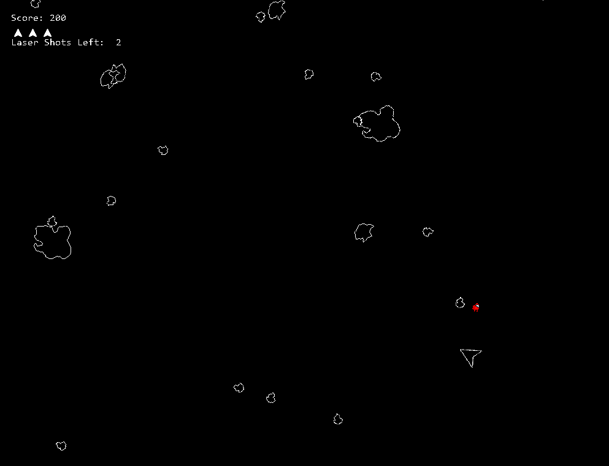
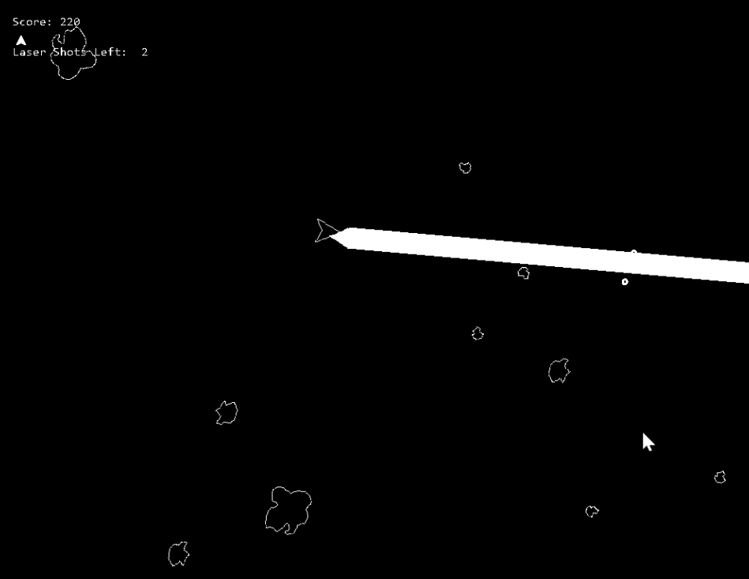

# Space Rocks
---
> Blast off into deep space to save Planet Earth from a devastatingly large meteor shower in this new take on the beloved arcade classic *Asteroids*(1979)!

## Story
Far in the future, Earth's top scientists detect a gigantic meteor heading straight for the planet!  In an attempt to thwart its course, they use a giant space laser to blow it to pieces.  However, this laser only shatters the giant asteroid into a ton of tiny ones!  You and your crew are dispatched in small fighter craft to take care of the impending shower before it can reach Earth.

## Features
- Lives: you get three. Run out, and humanity may get a taste of the Dinosaurs' medicine!
- A Giant Space Laser!! It destroys everything in your path, but it's very energy consuming, so you're limited to only three uses.  Use them wisely!
- Powerups? There's some unlucky astronauts floating around out there also, rescue them and they'll help repair your ship!
- Small, Medium, and Large asteroi-I mean space rocks!  Blast 'em!  The large ones break into two mediums, and the mediums into two smalls.

## Footage
  

## Controls
It's really simple!
|Control|Use|
|---|---|
|Left Arrow|Rotate Ship Counterclockwise|
|Right Arrow|Rotate Ship Clockwise|
|Up Arrow|Accelerate in direction of current heading|
|Space|Fire laser blasts!|
|Left Shift|Charge up a BIG laser blast!|

## Development

- **Engine:** GameMaker Studio LTS 2022
- **Programming:** GML Visual
- **Development Time:** ~3–4 weeks
- **Team:** Solo Project
- **Release Date:** December 2024

## Developer's Notes
This is the first "true" video game I ever created, as part of my high school's game development class.  It's not the highest quality, but it's a fun little game you can play when you're bored.  The only "videogame" i ever created prior to this was a *very* simple CLI text adventure game in Python.  This, however, was made (as all of my GameMaker games are) with GML Visual, because it's easy to use and also I never learned JavaScript.  It's very very unlikely that I come back and make any updates to this game, but it's always a possibility!

Lexi "CalculatedGoofball" B.
(President, CEO, CFO, Sole Developer, and Janitor of CG Studios)

## License
© 2024 CG Studios.  All Rights Reserved.
The original code, artwork, game design, and other original content created for Space Rocks are the property of CG Studios and are not released under an open-source license.
Third-party assets and media are not covered by the CG Studios copyright notice above and remain subject to their respective copyrights and licenses.
This repository is provided as a historical/portfolio archive of the project. No rights to third-party content are claimed by CG Studios.
